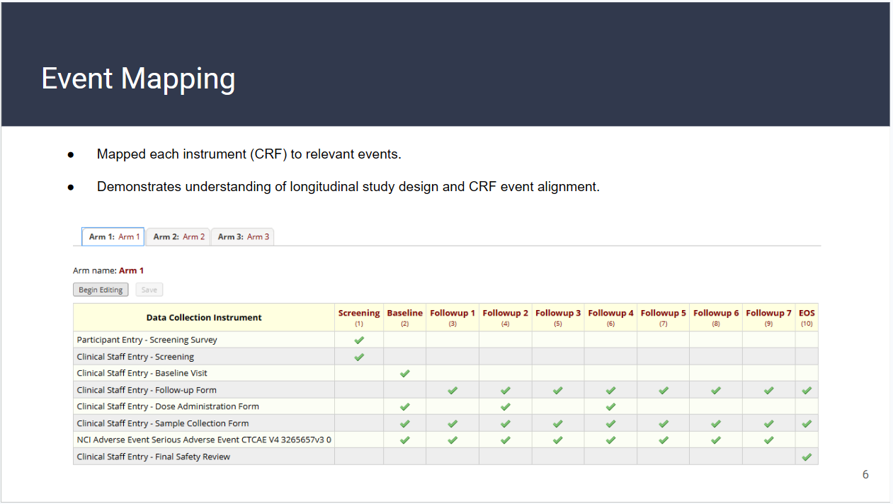
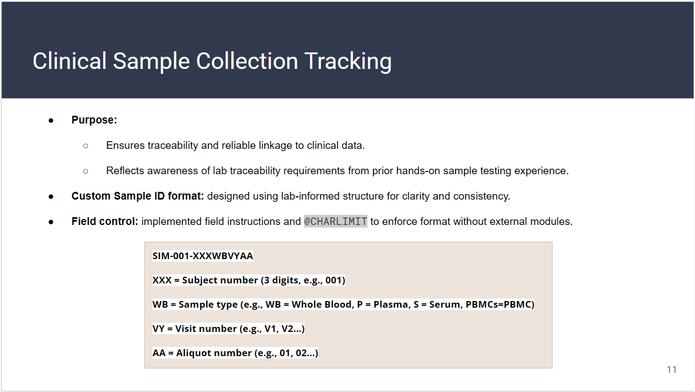
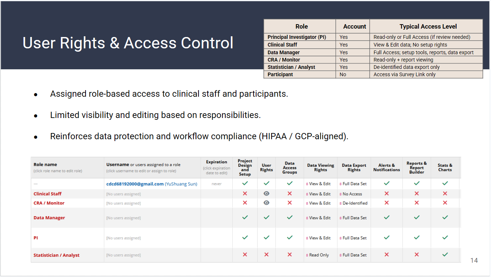
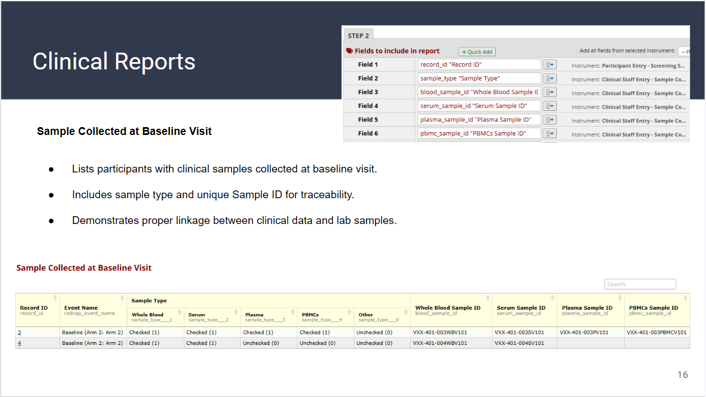

# Simulated Phase I Clinical Trial EDC Design

An independent portfolio project demonstrating the design of a simulated
Phase I clinical-trial data collection workflow using REDCap.

## Project Overview

This project simulates the design and configuration of an Electronic Data
Capture (EDC) environment for an early-phase vaccine clinical trial.

The objective was to translate a simulated study design into a structured
REDCap environment supporting longitudinal visits, clinical data collection,
sample traceability, safety documentation, data-quality controls, and
role-based access.

> **Portfolio Disclaimer**
>
> This is an independent simulation created for educational and portfolio
> purposes. It does not contain real participant data, confidential study
> information, or proprietary clinical-trial documents.

## What I Built

### Longitudinal Study Structure

- Configured three simulated study arms
- Created scheduled events from screening through end-of-study
- Mapped CRF instruments to appropriate study visits
- Designed a consistent visit structure across study arms

### CRF Design

Created or configured instruments for:

- Participant screening
- Demographics and medical history
- Clinical screening
- Baseline and follow-up visits
- Dose administration
- Clinical sample collection
- AE/SAE documentation
- Final safety review

### Clinical Sample Traceability

Designed a structured sample-identification approach linking:

- Participant
- Sample type
- Study visit
- Aliquot

Field instructions and REDCap action tags were used to improve consistency
and reduce sample-ID entry errors.

This portion of the simulation was informed by my prior hands-on experience
working with clinical samples and sample traceability in clinical research.

### Data Quality Controls

Implemented examples of:

- Required fields
- Range validation
- Conditional and branching logic
- Calculated fields
- Structured field instructions
- Sample-ID formatting controls
- De-identification practices

### Safety Data Workflow

Configured simulated AE/SAE documentation and a final safety-review
instrument to demonstrate how safety-related data could be structured
within a longitudinal EDC workflow.

### Role-Based Access

Created example user roles for:

- Principal Investigator
- Clinical staff
- Data Manager
- CRA / Monitor
- Statistician / Analyst

Permissions were configured according to simulated workflow responsibilities
and data-access needs.

### Clinical Reports

Built example REDCap reports to identify:

- Participants with reported adverse events
- Samples collected at baseline
- Sample type and sample ID
- Links between clinical records and biospecimen information

## Key Skills Demonstrated

- REDCap project configuration
- Longitudinal clinical-trial data structure
- CRF design
- Event-to-instrument mapping
- Clinical sample traceability
- Data validation and branching logic
- Clinical data-quality controls
- Role-based access design
- Clinical reporting
- De-identification concepts
- Protocol-to-CRF translation

## Tools

- REDCap
- Clinical data-management concepts
- Clinical sample workflow knowledge

## Key Learnings

This project strengthened my understanding of translating a clinical-study
concept into structured data-collection workflows.

Key challenges included:

- Translating study visits into longitudinal REDCap events
- Mapping CRFs to appropriate study timepoints
- Designing traceable sample identifiers
- Working within REDCap test-instance limitations
- Applying data-quality controls without external modules
- Designing role-based access around study responsibilities

## Project Demonstration

Below are selected views from the simulated REDCap build highlighting the
longitudinal study structure, clinical sample traceability, role-based access,
and clinical reporting.

### 1. Longitudinal Event Mapping

CRF instruments were mapped to scheduled study events to create a structured
longitudinal data-collection workflow.

### 2. Clinical Sample Traceability

A structured sample-identification approach was designed to link participant,
sample type, study visit, and aliquot information.

This portion of the simulation was informed by my prior hands-on experience
with clinical sample workflows and sample traceability in clinical research.

### 3. Role-Based Access Control

Example user roles and permissions were configured to demonstrate how access
could be structured according to different study responsibilities.

### 4. Clinical Reporting

Example REDCap reports were created to organize sample information and
demonstrate linkage between clinical records and biospecimen data.

---

## Full Project Presentation

The complete presentation provides additional detail on the simulated study
design, CRF development, event mapping, safety documentation, sample tracking,
data-quality controls, user permissions, and reporting.

### [View Full Project Presentation (PDF)](./REDCap-Phase-I-Clinical-Trial-Simulation.pdf)

---

> **Note:** This project is an independent simulation created for portfolio
> and educational purposes. It does not contain real participant data,
> confidential study information, or proprietary clinical-trial documents.
